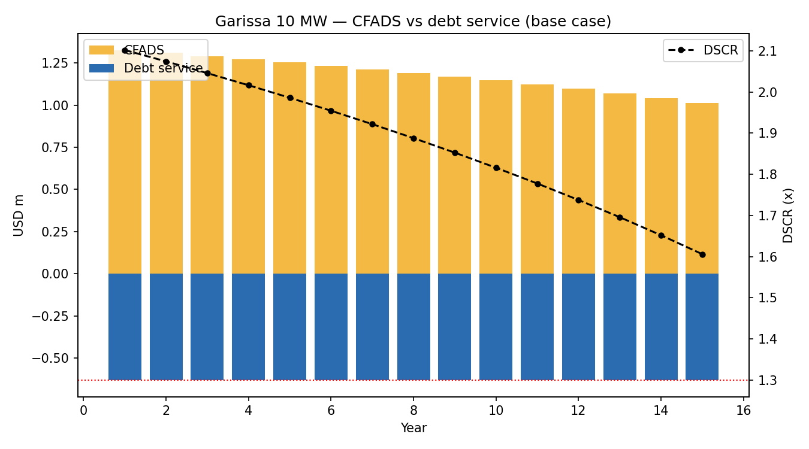
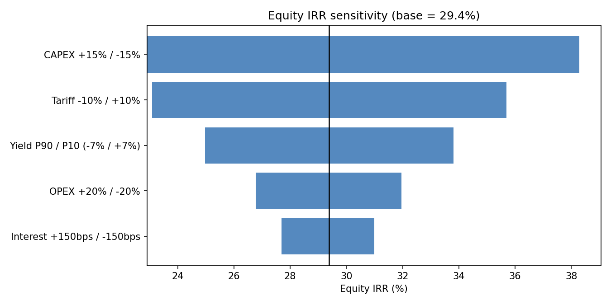

# Garissa Solar — 10 MW Project Finance Model (Kenya)

**Need a live solar or BESS model built, reviewed or stress-tested?**  
See Felix Keuya's renewable-energy model review service: https://felixkeuya.com/services/solar-bess-financial-modelling.html  
Check the likely scope, fee band and turnaround first: https://felixkeuya.com/project-fit.html

A lender-style project finance model for a 10 MW solar PV plant in Garissa, Kenya.
It links technical assumptions (yield, degradation, availability) to the numbers a
credit committee actually looks at: **equity IRR, DSCR, LLCR, LCOE and payback** —
under base, downside and upside cases.

The original Excel model (`Garissa Solar  Model.xlsx`) is kept for reference; the
Python model extends it with a debt layer, tax, degradation and scenario logic.

## Headline results

| Metric | Base | Downside | Upside |
|---|---|---|---|
| Project IRR (post-tax) | 16.3% | 9.4% | 18.0% |
| **Equity IRR** | **29.4%** | 7.6% | 37.4% |
| NPV @ 10% (USD m) | 3.32 | (0.33) | 3.98 |
| Min DSCR | 1.61x | **0.86x** | 1.96x |
| Avg DSCR | 1.88x | 1.15x | 2.25x |
| LLCR | 1.93x | 1.22x | 2.30x |
| Equity payback | 4 yrs | 17 yrs | 3 yrs |
| LCOE (real) | $0.071/kWh | $0.088/kWh | $0.066/kWh |




## What a lender would challenge

1. **The tariff is the whole story.** At $0.12/kWh the project clears every hurdle;
   recent Kenyan solar procurement has cleared well below $0.10. At $0.10 with a
   CAPEX overrun, **min DSCR falls to 0.86x — the downside case is not bankable at
   70% gearing.** Debt would be resized off the downside, not the base case
   (roughly 50–55% gearing to hold ≥1.20x through the downside).
2. **Offtaker credit.** Kenya Power payment delays are the real risk behind the
   flat USD tariff; a lender would require an escrow/letter-of-credit structure
   and would probe deemed-energy and curtailment provisions in the PPA.
3. **Yield basis.** The model runs P50; debt sizing uses P90 (−7% here). The
   tornado shows CAPEX and tariff dominate — yield matters less than commercial terms.
4. **FX.** Tariff is USD but land, labour and part of OPEX are KES; the model
   escalates OPEX at USD CPI in the base and 4% in the downside as a proxy.

## Assumptions register (base case)

| Block | Assumption | Value | Source |
|---|---|---|---|
| Technical | Capacity / yield / degradation | 10 MW / 15,945 MWh yr-1 / 0.5% p.a. | Excel model; panel warranty |
| Technical | Availability | 99% | O&M contract level |
| Revenue | Tariff | $0.12/kWh flat, 25-yr PPA | Excel model (lender challenge above) |
| Costs | CAPEX / OPEX yr-1 | $7.27m ($0.727/W) / $350.7k | Excel build-up |
| Debt | Gearing / rate / tenor | 70% / 9.0% USD / 15-yr annuity | Typical EA DFI terms |
| Tax | CIT / depreciation | 30% / 20-yr SL | Kenya, simplified |
| Valuation | Discount rate | 10% nominal | Excel model |

Scenario definitions live in [`model/assumptions.py`](model/assumptions.py) —
downside = P90 yield, $0.10 tariff, +15% CAPEX, +150bps debt; upside = strong
yield, −8% CAPEX, DFI-priced debt.

## Run it

```bash
pip install -r requirements.txt
python -m model.run_analysis
```

Outputs land in `outputs/`: scenario summary, full base-case cashflow ledger,
DSCR profile and equity-IRR tornado.

## Structure

```
model/assumptions.py   # every input, with source + scenario definitions
model/engine.py        # cashflows, debt schedule, tax, IRR/DSCR/LLCR/LCOE
model/run_analysis.py  # scenarios, sensitivities, charts
outputs/               # generated CSVs and charts
```

## Known simplifications

No construction period (CAPEX at t=0), no DSRA/cash sweep, no loss
carry-forward, single-point tax treatment. Each would move DSCR by basis
points, not the investment conclusion.

## License

MIT — free to use and adapt with attribution.
